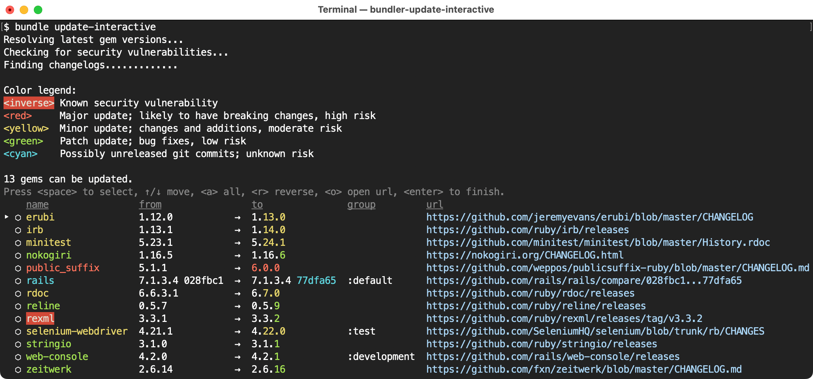
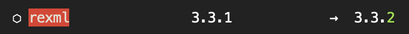

# bundle_update_interactive

[](https://rubygems.org/gems/bundle_update_interactive)
[](https://www.ruby-toolbox.com/projects/bundle_update_interactive)
[](https://github.com/mattbrictson/bundle_update_interactive/actions/workflows/ci.yml)
[](https://codeclimate.com/github/mattbrictson/bundle_update_interactive)

**This gem adds an `update-interactive` command to [Bundler](https://bundler.io).** Run it to see what gems can be updated, then pick and choose which ones to update. If you've used `yarn upgrade-interactive`, the interface should be very familiar.



---

- [Quick start](#quick-start)
- [Options](#options)
- [Features](#features)
- [Prior art](#prior-art)
- [Support](#support)
- [License](#license)
- [Code of conduct](#code-of-conduct)
- [Contribution guide](#contribution-guide)

## Quick start

Install the gem:

```
gem install bundle_update_interactive
```

Now you can use:

```
bundle update-interactive
```

Or the shorthand:

```
bundle ui
```

## Options

- `--latest` [modifies the Gemfile if necessary to allow the latest gem versions](#allow-latest-versions)
- `-D` / `--exclusively=GROUP` [limits updatable gems by Gemfile groups](#limit-impact-by-gemfile-groups)

## Features

### Semver highlighting

`bundle update-interactive` highlights each gem according the severity of its version upgrade.


Gems sourced from Git repositories are highlighted in cyan, regardless of the semver change, due to the fact that new commits pulled from the Git repo may not yet be officially released. In this case the semver information is unknown.

`bundle update-interactive` also highlights the exact portion of the version number that has changed, so you can quickly scan gem versions for important differences.


### Security vulnerabilities

`bundle update-interactive` uses [bundler-audit](https://github.com/rubysec/bundler-audit) internally to search for outdated gems that have known security vulnerabilities. These gems are highlighted prominently with white text on a red background.



Some gems, notably `rails`, are composed of smaller gems like `actionpack`, `activesupport`, `railties`, etc. Because of how these component gem versions are constrained, you cannot update just one of them; they all must be updated together.

Therefore, if any Rails component has a security vulnerability, `bundle update-interactive` will automatically roll up that information into a single `rails` line item, so you can select it and upgrade all of its components in one shot.

### Held back gems

When a newer version of a gem is available, but updating is not allowed due to a Gemfile requirement, `update-interactive` will report that the gem has been held back.


To allow updates for gems that would normally be held back, use the `--latest` option (explained in the next section).

### Allow latest versions

Normally `update-interactive` only makes changes to your Gemfile.lock. It honors the version restrictions ("pins") in your Gemfile and will not update your Gemfile.lock to have versions that are not allowed. However with the `--latest` flag, update-interactive can update the version pins in your Gemfile as well. Consider the following Gemfile:

```ruby
gem "rails", "~> 7.1.0"
```

Normally running `bundle update-interactive` will report that Rails is held back and therefore cannot be updated to the latest version. However, if you pass the `--latest` option like this:

```
bundle update-interactive --latest
```

Now Rails will be allowed to update. If you select to update Rails to the latest version (e.g. 7.2.0), `update-interactive` will modify the version requirement in your Gemfile to look like this:

```ruby
gem "rails", "~> 7.2.0"
```

In other words, it works similarly to `yarn upgrade-interactive --latest`.

### Changelogs

`bundle update-interactive` will do its best to find an appropriate changelog for each gem.

It prefers the `changelog_uri` [metadata](https://guides.rubygems.org/specification-reference/#metadata) published in the gem itself. However, this metadata field is optional, and many gem authors do not provide it.

As a fallback, `bundle update-interactive` will check if the gem's source code is hosted on GitHub, and scans the GitHub repo for obvious changelog files like `CHANGELOG.md`, `NEWS`, etc. Finally, if the project is actively documenting versions using GitHub Releases, the Releases URL will be used.

If you discover a gem that is missing a changelog in `bundle update-interactive`, [log an issue](https://github.com/mattbrictson/bundle_update_interactive/issues) and I'll see if the algorithm can be improved.

### Git diffs

If your `Gemfile` sources a gem from a Git repo like this:

```ruby
gem "rails", github: "rails/rails", branch: "7-1-stable"
```

Then `bundle update-interactive` will show a diff link instead of a changelog, so you can see exactly what changed when the gem is updated. For example:

https://github.com/rails/rails/compare/5a8d894...77dfa65

This feature currently works for GitHub, GitLab, and Bitbucket repos.

### Limit impact by Gemfile groups

The effects of `bundle update-interactive` can be limited to one or more Gemfile groups using the `--exclusively` option:

```sh
bundle update-interactive --exclusively=group1,group2
```

This is especially useful when you want to safely update a subset of your lock file without introducing any risk to your application in production. The best way to do this is with `--exclusively=development,test`, which can be abbreviated to simply `-D`:

```sh
# Update non-production dependencies.
# This is equivalent to `bundle update-interactive --exclusively=development,test`
bundle update-interactive -D
```

The `--exclusively` and `-D` options will cause `update-interactive` to only consider gems that are used _exclusively_ by the specified Gemfile groups. Indirect dependencies that are shared with other Gemfile groups will not be updated.

For example, given this Gemfile:

```ruby
gem "rails"

group :test do
  gem "capybara"
end
```

If `--exclusively=test` is used, `capybara` and its indirect dependency `xpath` are both exclusively used in test and can therefore be updated. However, capybara's `nokogiri` indirect dependency, which is also used in production via `rails` → `actionpack` → `nokogiri`, would not be allowed to update.

### Conservative updates

`bundle update-interactive` updates the gems you select by running `bundle update --conservative [GEMS...]`. This means that only those specific gems will be updated. Indirect dependencies shared with other gems will not be affected.


An exception is made for "meta gems" like `rails` that are composed of dependencies locked at exact versions. For example, if you chose to upgrade `rails`, the actual command issued to Bundler will be:

```
bundle update --conservative \
  rails \
  actioncable \
  actionmailbox \
  actionmailer \
  actionpack \
  actiontext \
  actionview \
  activejob \
  activemodel \
  activerecord \
  activestorage \
  activesupport \
  railties
```

## Prior art

This project was inspired by [yarn upgrade-interactive](https://classic.yarnpkg.com/lang/en/docs/cli/upgrade-interactive/), and borrows many of its interface ideas.

Before creating `bundle update-interactive`, I published [bundleup](https://github.com/mattbrictson/bundleup), a gem that serves a similar purpose but with a simpler, non-interactive approach.

## Support

If you want to report a bug, or have ideas, feedback or questions about the gem, [let me know via GitHub issues](https://github.com/mattbrictson/bundle_update_interactive/issues/new) and I will do my best to provide a helpful answer. Happy hacking!

## License

The gem is available as open source under the terms of the [MIT License](LICENSE.txt).

## Code of conduct

Everyone interacting in this project’s codebases, issue trackers, chat rooms and mailing lists is expected to follow the [code of conduct](CODE_OF_CONDUCT.md).

## Contribution guide

Pull requests are welcome!

To test your locally cloned version of `bundle update-interactive`, run `rake install`. This will install the gem and its executable so that you can try it out on other local projects.

Before submitting a PR, make sure to run `rake` to see if there are any RuboCop or test failures.
